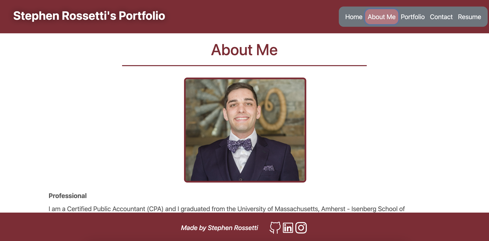
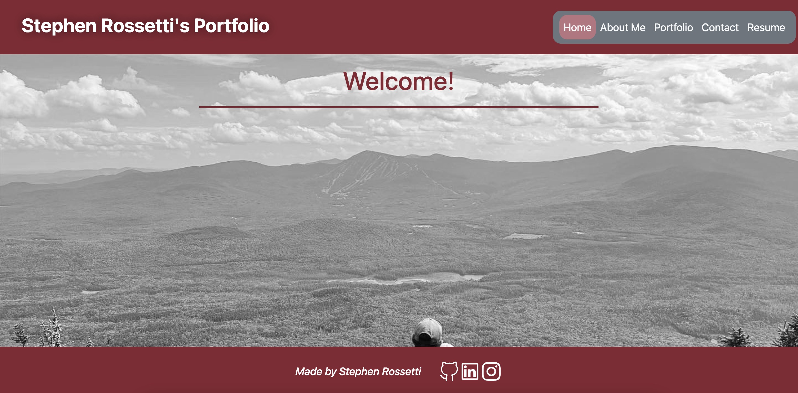
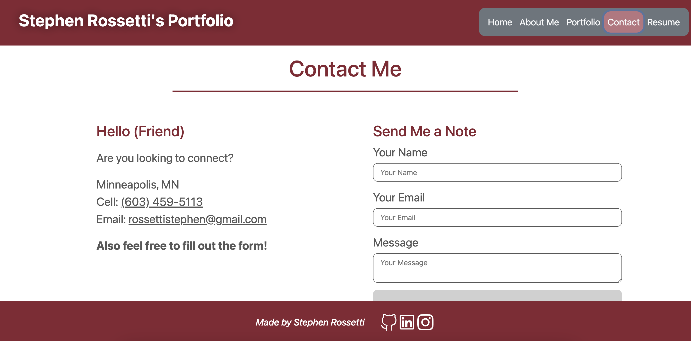
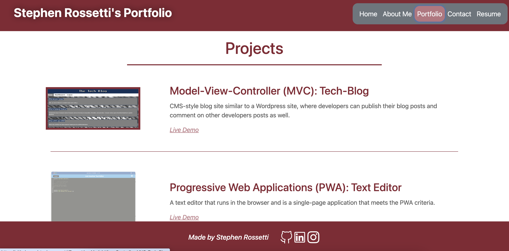
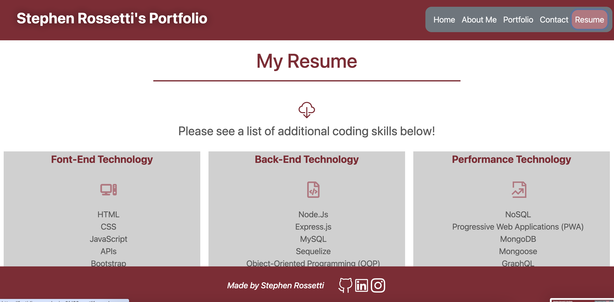

# Rossetti-s-React-Challenge-React-Portfolio

<a name="readme-top"></a>

[![Contributors][contributors-shield]][contributors-url]

<br />
<div align="center">
<a href="https://github.com/stephenrossetti/Rossetti-s-React-Challenge-React-Portfolio">

</a>

<h3 align="r">React Challenge: React Portfolio</h3>
<p align="center">
    Check out the app here!
<br />

<br />
<a href="https://fastidious-vacherin-3fd62c.netlify.app/">View App on Netlify</a>
    ·
<a href="https://github.com/stephenrossetti/Rossetti-s-React-Challenge-React-Portfolio/issues">Report Bug</a>
    ·
<a href="https://github.com/stephenrossetti/Rossetti-s-React-Challenge-React-Portfolio/issues">Request Feature</a>
  </p>
</div>

<details>
<summary>Table of Contents</summary>
<ol>
<li><a href="#overview-of-React-Portfolio">Overview of React Portfolio</a></li>
<li><a href="#user-story">User Story</a></li>
<li><a href="#acceptance-criteria">Acceptance Criteria</a></li>
<li><a href="#getting-started">Getting Started</a><li>
<ul>
<li><a href="#prerequisites">Prerequisites</a></li>
<li><a href="#installation">Installation</a></li>
</ul>
</li>
<li><a href="#technology-used">Technology Used</a></li>
<li><a href="#usage">Usage</a></li>
<li><a href="#links">Links</a></li>
<li><a href="#contributing">Contributing</a></li>
<li><a href="#license">License</a></li>
<li><a href="#contact-us">Contact Us </a></li>
<li><a href="#credits">Credits</a></li>
<li><a href="#acknowledgments">Acknowledgments</a></li>
</ol>
</details>

## Overview of React Portfolio

React Challenge: React Portfolio, or Module-20's Challenge, was to build a portfolio using React to showcase our ability to utilize the latest technologies. The app will act a a place not only to share my projects while I apply for jobs or working as a freelancer, but also act a place to share my work with other developers and collaborate on projects. Ultimately, this website was deployed to Netlify.

Along with other skills learned in previous challenges, this challenge tested our ability to use React and React-Router-DOM, as well as additional coding set-up utilizing components, pages and JSX.

## User Story

```
AS AN employer looking for candidates with experience building single-page applications
I WANT to view a potential employee's deployed React portfolio of work samples
SO THAT I can assess whether they're a good candidate for an open position
```

## Acceptance Criteria

```
GIVEN a single-page application portfolio for a web developer
WHEN I load the portfolio
THEN I am presented with a page containing a header, a section for content, and a footer
WHEN I view the header
THEN I am presented with the developer's name and navigation with titles corresponding to different sections of the portfolio
WHEN I view the navigation titles
THEN I am presented with the titles About Me, Portfolio, Contact, and Resume, and the title corresponding to the current section is highlighted
WHEN I click on a navigation title
THEN the browser URL changes and I am presented with the corresponding section below the navigation and that title is highlighted
WHEN I load the portfolio the first time
THEN the About Me title and section are selected by default
WHEN I am presented with the About Me section
THEN I see a recent photo or avatar of the developer and a short bio about them
WHEN I am presented with the Portfolio section
THEN I see titled images of six of the developer’s applications with links to both the deployed applications and the corresponding GitHub repositories
WHEN I am presented with the Contact section
THEN I see a contact form with fields for a name, an email address, and a message
WHEN I move my cursor out of one of the form fields without entering text
THEN I receive a notification that this field is required
WHEN I enter text into the email address field
THEN I receive a notification if I have entered an invalid email address
WHEN I am presented with the Resume section
THEN I see a link to a downloadable resume and a list of the developer’s proficiencies
WHEN I view the footer
THEN I am presented with text or icon links to the developer’s GitHub and LinkedIn profiles, and their profile on a third platform (Stack Overflow, Twitter)
```

<p align="right">(<a href="#readme-top">back to top</a>)</p>

## Technology Used

- 

- 

- 

- 

- 

- 

## Getting Started

How to get started with the React Portfolio!

### Prerequisites

- npm
- Netlify

### Installation

Instructions on how to download our app.

1. Visit our app on [Netlify](https://fastidious-vacherin-3fd62c.netlify.app/)

OR

1. Visit us @ [https://github.com/stephenrossetti](https://github.com/stephenrossetti/Rossetti-s-React-Challenge-React-Portfolio)
2. Clone the repo
   ```sh
   git@github.com:stephenrossetti/Rossetti-s-React-Challenge-React-Portfolio.git
   ```
3. Install NPM packages

   ```sh
   npm i
   ```

4. To run, build, or further install packages on our app choose between the following inputs defined in the package.json: dev, start, and build

   ```sh
      npm run [INPUT]
   ```

5. Run and connect

   ```sh
   http://localhost:3000
   ```

<p align="right">(<a href="#readme-top">back to top</a>)</p>

## Usage







## Links
[The URL to Netlify](https://fastidious-vacherin-3fd62c.netlify.app/)

[The URL of the Github Repository](https://github.com/stephenrossetti/Rossetti-s-React-Challenge-React-Portfolio)

<p align="right">(<a href="#readme-top">back to top</a>)</p>

## Contributing

Here is how you can be apart of creating Social Network API.

1. Fork the Project
2. Create your Feature Branch (`git checkout -b [BRANCH NAME]`)
3. Commit your Changes (`git commit -m 'Add my commits to main'`)
4. Push to the Branch (`git push origin main`)
5. Open a Pull Request

<p align="right">(<a href="#readme-top">back to top</a>)</p>

## License

N/A

<p align="right">(<a href="#readme-top">back to top</a>)</p>

## Contact Us

Contact me ([Stephen Rossetti](https://github.com/stephenrossetti)) if you have any questions or feedback.

<p align="right">(<a href="#readme-top">back to top</a>)</p>

## Credits

Coding help from external sources:

- Utilized Module-20-React activities for templates and starting points. Including, but not limited to, the form data (Activity 16), the routes and initial format (Activity 24), and additional functionality (Activity 28)
- Utilized TAs for debugging help.
- Utilized StackOverflow for utilities such as email regular expression.
- Utilized bootstrap and previous projects for initial CSS.

<p align="right">(<a href="#readme-top">back to top</a>)</p>

## Acknowledgments

Thanks to our resources on creating our app!

- [Visual Studio Code](https://code.visualstudio.com/)
- [Netlify](https://https://netlify.com/)
- [Static Badges](https://shields.io/badges)

<p align="right">(<a href="#readme-top">back to top</a>)</p>

[contributors-shield]:https://img.shields.io/badge/CONTRIBUTORS%20--4?style=for-the-badge&logo=gitlab&labelColor=WHITE
[contributors-url]: https://github.com/stephenrossetti/Rossetti-s-React-Challenge-React-Portfolio/graphs/contributors